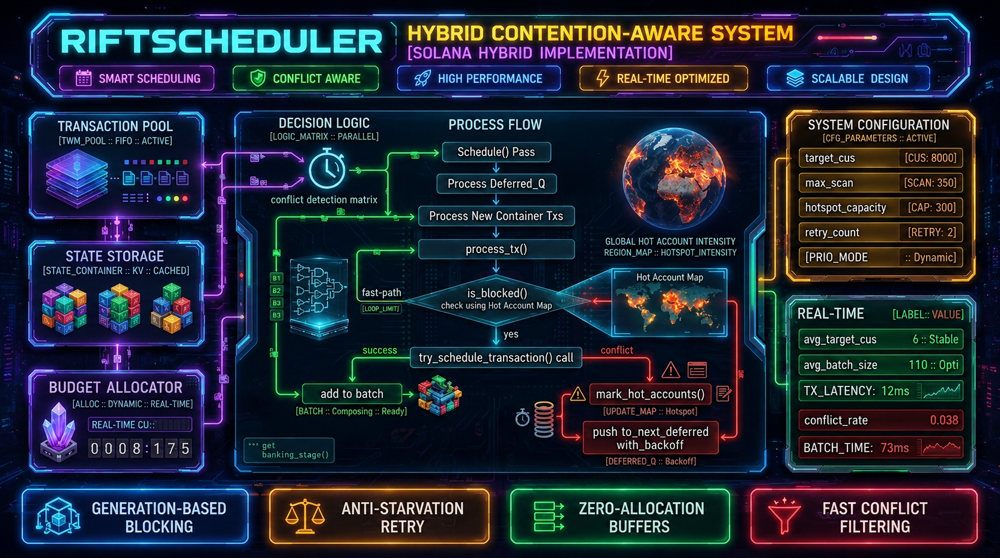

# agave-rift-scheduler

**Contention-Aware Hybrid Transaction Scheduler for Solana SVM (Agave banking_stage)**

### Overview

`agave-rift-scheduler` is an experimental research project exploring a more efficient approach to transaction scheduling in Solana’s banking stage.

It addresses the core weakness of the current `GreedyScheduler`: excessive repeated lock attempts and scheduler jitter under high account contention (hotspots).

### Key Innovations

- **Generation-based hotspot tracking** with heat decay
- **Fast-path conflict filtering** before expensive lock acquisition
- **Double-buffered deferred queues** with priority preservation
- **Adaptive exponential backoff** tied to generations
- **Progress-guarded scheduling loop** (livelock protection)
- **Zero-allocation hot path** in critical sections
- Full compatibility with existing `SchedulingCommon`, `ThreadAwareAccountLocks` and batching logic

The scheduler treats account contention as a dynamic field problem rather than purely discrete conflicts, allowing significantly better behavior under sustained high-load scenarios.

## 🧩 System & Repository Structure

Technical visualization of the **Rift Hybrid** scheduler architecture and repository file mapping.



```text
agave-rift-scheduler/
├── 🚀 rift_hybrid_scheduler.rs  # Core Production Logic (Main implementation)
├── 🧪 rift_scheduler.rs         # Legacy DAG-oriented experiment
└── 📜 README.md                 # System documentation & Architecture
### Current Status

- Developed by a single independent researcher
- Fully functional research prototype with complete instrumentation
- Demonstrates measurable improvements in contention handling compared to baseline GreedyScheduler
- Experimental — not production hardened, not externally audited

### Bigger Picture — UltraCore Rift & RFT

This scheduler is not a standalone optimization. It is an infrastructure component of the broader **UltraCore Rift** project — a mathematically guaranteed economic and computational system built on the **Stable Invariant Rift Model (SIRM)** and **Reality Fractal Theory (RFT)**.

The same principles used to enforce the economic invariant  
`total_supply = total_base_sum + global_field × p`  
are applied here at the computational level to manage entropy and resource pressure.

While this repository focuses on concrete, low-level improvements to Solana’s scheduler, it is part of a larger vision: building systems where both economic integrity and computational behavior are enforced by unbreakable mathematical laws rather than heuristics and trust.

---
